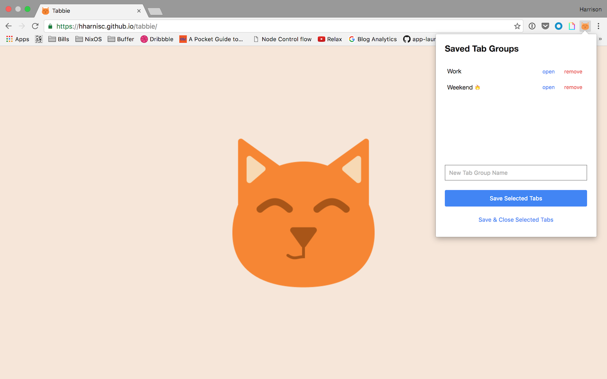

# Tabbie

The missing tab manager for Chrome.

Friday evening comes along and you want to save your chrome tabs from the week so you can pick em back up on Monday.

Chrome Web Store: https://chrome.google.com/webstore/detail/tabbie/aingjdeimmekeknhjcbnigfbfbboffeo

## Release Notes

**0.3.2**

- Show invalid state on input when no value is set (fixes #8)

**0.3.1**

- Form items get focus before tab groups (fixes #7)

**0.3.0**

- Default to save all chrome tabs in the current window
- Toggle checkbox to save selected tabs
- a11y fixes (Thanks [Rahul](https://github.com/Primigenus)!)
- Display extension icon in Chrome extensions manager

## Contributing

Pull requests welcome!
